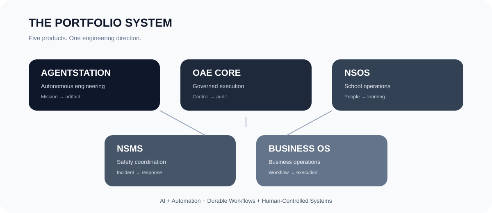
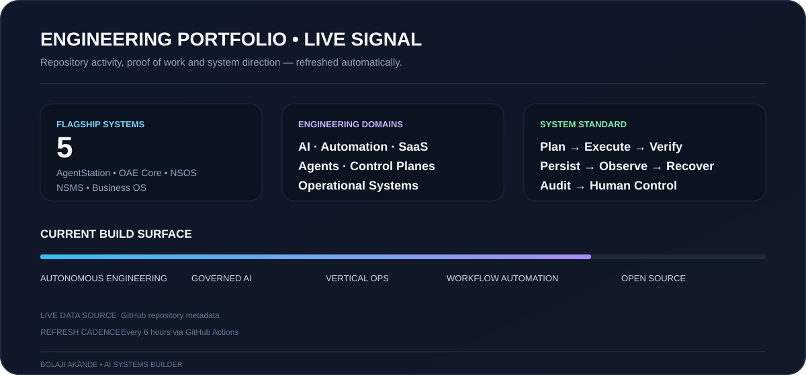
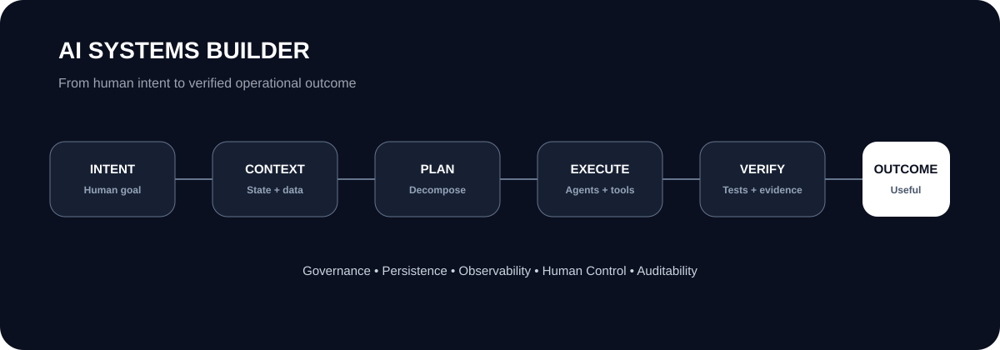

<div align="center">

# BOLAJI AKANDE

### AI Systems Builder · Automation Engineer · Product Engineer

**I design and build AI-native software that can plan, execute, verify and operate real workflows.**

<p>
  <a href="https://github.com/Olori24/AgentStation">AgentStation</a> ·
  <a href="https://github.com/Olori24/oae-core">OAE Core</a> ·
  <a href="https://github.com/Olori24/nsos-nigerian-school-operating-system-nigerian-school-operating-system">NSOS</a> ·
  <a href="https://github.com/Olori24/NSMS">NSMS</a> ·
  <a href="https://github.com/Olori24/Business-Operating-System-">Business OS</a>
</p>


</div>

---

<p align="center">
  
</p>

## ⚡ The 10-second version

I build **systems around intelligence**, not just chat interfaces.

My work sits at the intersection of:

**AI agents · software engineering · workflow automation · operational software · developer infrastructure**

The recurring architecture is:

> **Intent → Context → Plan → Execute → Verify → Persist → Observe → Recover → Audit → Outcome**

The goal is simple: **make complex work executable without making the system uncontrollable.**

---

<p align="center">
  
</p>

> **Portfolio principle:** no badge wall, no inflated metrics, no decorative claims. The repositories are the proof.

---

## 🧠 What I actually build

<table>
<tr>
<td width="50%" valign="top">

### 01 · Autonomous Engineering

Systems that turn a mission into a sequence of engineering tasks, coordinate specialist agents, produce artifacts and verify the result.

**Keywords:** agent orchestration · planning · code generation · sandboxing · QA · artifact synthesis

</td>
<td width="50%" valign="top">

### 02 · Governed AI Infrastructure

Control-plane primitives that answer the hard questions around intelligent execution.

**Keywords:** authorization · jobs · persistence · audit · observability · tenant boundaries · recovery

</td>
</tr>
<tr>
<td width="50%" valign="top">

### 03 · Vertical Operating Systems

Reusable infrastructure patterns applied to real operational environments rather than toy demos.

**Keywords:** schools · businesses · communities · workflows · notifications · evidence

</td>
<td width="50%" valign="top">

### 04 · Practical Automation

Replacing repetitive manual work with measurable, durable workflows.

**Keywords:** integrations · APIs · automation · data flows · human approval · operational dashboards

</td>
</tr>
</table>

---

# 🚀 Flagship systems

## AgentStation
### Mission → Software Artifact

An autonomous engineering workspace built around coordinated specialist agents.

**Engineering surface**
- Mission decomposition
- Multi-agent orchestration
- Full-stack artifact generation
- In-browser development workspace
- Verification and QA workflows
- Developer-facing execution

**Repository:** <a href="https://github.com/Olori24/AgentStation">Olori24/AgentStation →</a>

---

## OAE Core
### Control → Governed Execution

A governed engineering control plane for repositories, workspaces, jobs and controlled execution.

**Engineering surface**
- Authorization boundaries
- Workspace lifecycle
- Durable job delivery
- Repository foundations
- Controlled build execution
- Auditability

**Repository:** <a href="https://github.com/Olori24/oae-core">Olori24/oae-core →</a>

---

## NSOS
### Institution → Operating System

A Nigeria-first operating system for schools and learning institutions, designed around one controlled workspace for institutional operations.

**Engineering surface**
- Multi-tenant architecture
- People and learning workflows
- Administration
- Communication
- Payments
- Supervised AI

**Repository:** <a href="https://github.com/Olori24/nsos-nigerian-school-operating-system-nigerian-school-operating-system">Olori24/NSOS →</a>

---

## NSMS
### Incident → Coordination → Response

A neighbourhood safety coordination platform connecting residents, operators and authorized responders.

**Engineering surface**
- Multi-tenant incident management
- Evidence workflows
- Notifications
- Incident timelines
- Audit trails
- Human-controlled AI assistance

**Repository:** <a href="https://github.com/Olori24/NSMS">Olori24/NSMS →</a>

---

## Business OS
### Workflow → Operations

A programmable operating layer for modern businesses.

**Engineering surface**
- Durable workflows
- Integrations
- Notifications
- Operational dashboards
- Multi-tenant SaaS foundations

**Repository:** <a href="https://github.com/Olori24/Business-Operating-System-">Olori24/Business-Operating-System- →</a>

---

## 🔬 The portfolio is a system

These projects are deliberately connected.

**AgentStation** explores autonomous execution.  
**OAE Core** explores governance and control.  
**NSOS, NSMS and Business OS** apply those primitives to real operational domains.

Together:

```text
                    HUMAN GOAL
                        │
                        ▼
                 ┌─────────────┐
                 │   CONTEXT   │
                 └──────┬──────┘
                        │
                        ▼
                 ┌─────────────┐
                 │    PLAN     │
                 └──────┬──────┘
                        │
             ┌──────────┴──────────┐
             ▼                     ▼
       SPECIALIST AGENTS      WORKFLOW ENGINE
             │                     │
             └──────────┬──────────┘
                        ▼
                 ┌─────────────┐
                 │   EXECUTE   │
                 └──────┬──────┘
                        ▼
                 ┌─────────────┐
                 │   VERIFY    │
                 └──────┬──────┘
                        ▼
              PERSIST · OBSERVE · AUDIT
                        │
                        ▼
                 USEFUL OUTCOME
```

<p align="center">
  
</p>

---

# 🧱 Engineering doctrine

| Principle | Implementation mindset |
|---|---|
| **Human authority** | Automation expands capability; it does not silently take authority that belongs to people. |
| **Evidence before claims** | Prefer observable state, test results, audit records and reproducible outputs. |
| **Durable execution** | Important work should survive retries, restarts, failures and partial completion. |
| **Secure boundaries** | Permissions, tenant isolation and secrets belong in the architecture. |
| **Verification is completion** | Generated is not the same as finished. Build, test, inspect and verify. |
| **AI with boundaries** | Agents operate inside explicit scopes, tools and approval rules. |

---

# 🛠️ Technical surface

<div align="center">

### Languages & runtime

**TypeScript · JavaScript · Python · Node.js**

### Application engineering

**React · Next.js · FastAPI · Express · PostgreSQL · SQLite**

### Infrastructure

**Docker · GitHub Actions · REST APIs · Cloud Deployment**

### AI & automation

**LLM APIs · AI Agents · RAG · OCR · Workflow Automation · Tool Calling**

</div>

---

# 📡 Current build direction

### 01 — Autonomous engineering
Moving from systems that **answer** toward systems that **execute multi-step missions and produce verifiable artifacts**.

### 02 — Governed AI infrastructure
Building the control layer around **authorization, execution, persistence, observability and auditability**.

### 03 — Vertical operating systems
Turning reusable infrastructure into products for **schools, businesses, communities and other operational environments**.

### 04 — Practical automation
Using AI where it creates leverage — while keeping workflows **measurable, inspectable and recoverable**.

---

# 🌍 More work

The wider portfolio includes:

- AI opportunity intelligence for Africa
- Sales automation
- Business workflow systems
- AI workforce infrastructure
- Developer tooling
- Data and analytics workflows
- Africa-focused digital products

<a href="https://github.com/Olori24?tab=repositories">Explore all repositories →</a>

---

# 🤝 Open to building

I am interested in collaborating on:

**AI-native products · Agent infrastructure · Automation · SaaS · Developer tools · Operational software · AI product engineering**

If the problem is complicated enough to need a system, **let's build the system.**

---

<div align="center">

### BUILD SYSTEMS.
### AUTOMATE THE WORK.
### KEEP HUMANS IN CONTROL.

<br>

**Bolaji Akande**

<sub>AI Systems · Automation · Product Engineering</sub>

</div>
